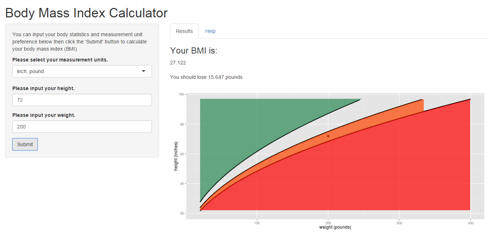
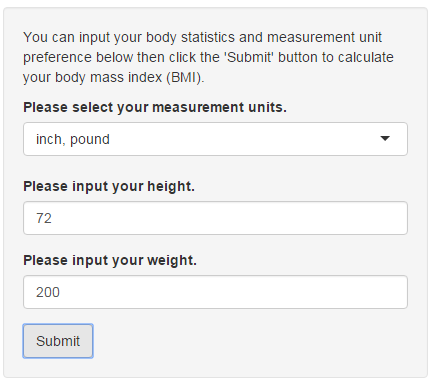
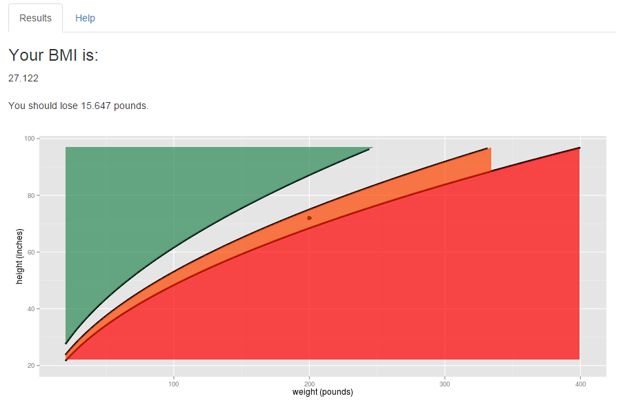
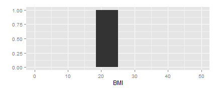

## Introduction

Thank you for using the Body Mass Index Calculator, created as a web application by Faisal Samir. This app is unique and different from all other body mass index (BMI) apps currently available on the web.

Not only is your BMI accurately calculated, but you're also told how much weight to lose or gain to achieve a healthy figure. In addition, a plot is graphed with different sections by BMI for easily visualization.

The app is conveniently packed onto a single page, and 4 easy steps will give you all of the knowledge you need to jump start your quest to maintaining healthy weight!

--- .class #id 

## Overview

<center></center>

The app is all conveniently placed on one screen. Inputs are typed into the appropriate boxes on the left sidebar, and results are displayed on the right as text and in a plot. The tabs on the top-right side of the screen can quickly toggle between results and a quick user guide. 

---

## Input

<center></center>

The input sidebar is designed to be as simple and user-friendly as possible. First, you're given a choice between measurement units to cater to your preference. Then, you can input the height and weight by typing or scrolling. Finally, hitting the "Submit" button will quickly display results on the right of the screen.

---

## Output

<center></center>

Your results are displayed as per your input. At the top, you receive a numerical BMI value for your reference. Directly beneath this value is a message telling you how much weight you have to lose or gain to reach the target BMI range of 18.5 - 25. A plot is displayed at the bottom with colored zones representing different BMI zones, underweight being green, normal being colorless, overweight being orange, and obese being red. A thick dot on the plot also shows you exactly where your placement is.

---

## Last Check!

There's only one more thing to check to see if you can use the app effectively! Which BMI range is best and considered healthy? See the graph below for the answer!


```r
library(ggplot2)
qplot(0:50, rep(1, 51), geom = "blank") + 
    geom_rect(aes(xmin=18.5, xmax=25, ymin=0, ymax=1)) + xlab("BMI") + ylab("")
```

 

The black bar is best, representing BMI's of 18.5 - 25 !
